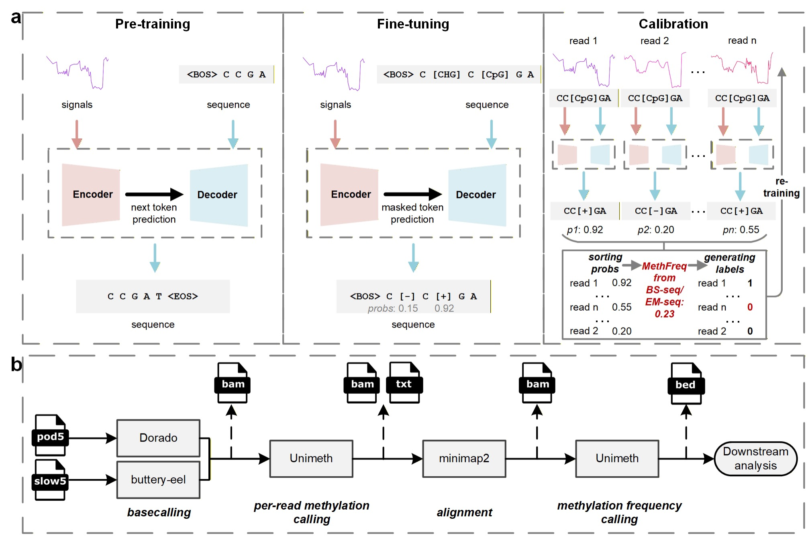
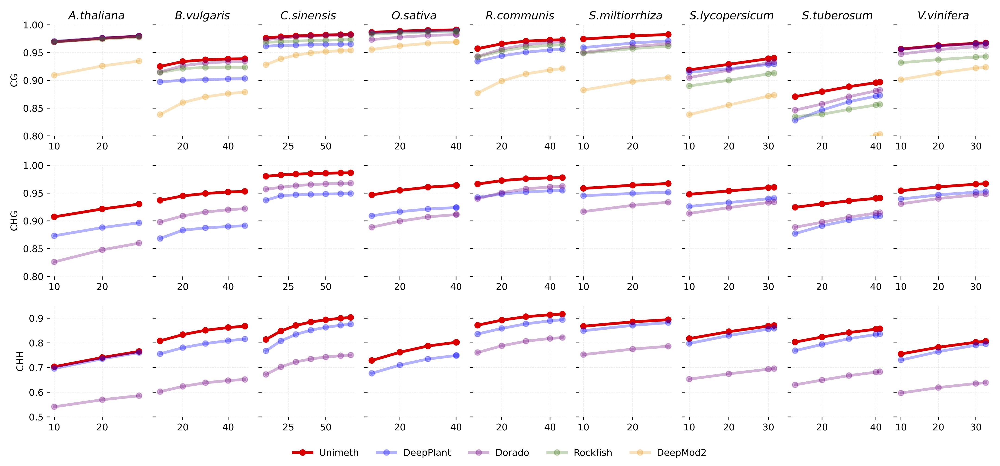

# Unimeth: A Unified Transformer Framework for DNA Methylation Detection from Nanopore Reads

[](LICENSE)
[](https://www.python.org/)
[](https://doi.org/10.64898/2025.12.05.692231)


**Unimeth** is a unified deep learning framework for accurate and efficient detection of DNA methylation (5mC, 6mA) from Oxford Nanopore sequencing data. Built on a transformer-based architecture, Unimeth supports multiple sequencing chemistries (R9.4.1, R10.4.1 4kHz/5kHz), handles both plant and mammalian genomes, and achieves state-of-the-art performance across diverse genomic contexts.

---

## 🧬 Features

- **Unified Detection**: Simultaneously detects 5mC (CpG, CHG, CHH) and 6mA methylation.
- **Multi-Chemistry Support**: Compatible with R9.4.1, R10.4.1 4kHz, and R10.4.1 5kHz chemistries.
- **Patch-Based Transformer**: Captures contextual dependencies between neighboring methylation sites.
- **Multi-Phase Training**: Pre-training, read-level fine-tuning, and site-level calibration for robust performance.
- **Low False Positive Rate**: Especially effective in non-CpG contexts and low-methylation regions.
- **Easy-to-Use**: Standard input/output formats (POD5 and BAM, BED).

---

## 📦 Installation

### Prerequisites

- Python 3.12+
- [Dorado](https://github.com/nanoporetech/dorado) for basecalling

### Install from Source

```bash
git clone https://github.com/sekeyWang/unimeth.git
cd unimeth

conda create -n unimeth python=3.12
conda activate unimeth

pip install unimeth .

```
Use unimeth -v to validate it successfully installed if it shows the version.

---

## 🚀 Quick Start

### 1. Basecalling and Alignment

Use `dorado` to basecall and align your nanopore reads:

```bash
dorado basecaller --emit-moves dna_r10.4.1_e8.2_400bps_sup@v5.0.0 pod5/ > calls.bam
```

### 2. Download model checkpoints and sample data

- **Model**: Download `unimeth_r10.4.1_5kHz_5mC.pt` from [Google Drive](https://drive.google.com/drive/folders/1f8bWVFmbPxL6WqukOUi_BufCEvpOHaxR) to the `checkpoints` folder
- **Sample Data**: Download the demo dataset using one of the following methods:

```bash
mkdir demo
pip install gdown
gdown --folder https://drive.google.com/drive/folders/1Gu7hgOQbHSUULG1MXjdE_qJ3na-6AdLi -O demo/
```
The demo dataset includes:

- `demo.bam` - aligned reads
- `subset_18.pod5` - raw signal data

### 3. Methylation Calling with Unimeth

Run Unimeth to detect methylation (use `--accelerator` to enable multi-GPUs if available):

```bash
unimeth \
--pod5_dir demo/subset_18.pod5 \
--bam_dir demo/demo.bam \
--model_dir checkpoints/unimeth_r10.4.1_5kHz_5mC.pt \
--out_dir results/arab.bed \
--cpg 1 \
--chg 1 \
--chh 1 \
--batch_size 256 \
--pore_type R10.4.1 \
--frequency 5khz \
--dorado_version 0.71
```

### 3. Output

Unimeth outputs read-level methylation calls in **tsv** format. A sample output is as follows:


| Chromosome | Ref pos| Strand | Dorado pred | Read id| Read pos | Motif tyle  | Pred positive  | Pred negative | Pred(0/1) | . |
|--------|-----------|----|-------|-----------------------------------|-------|--------|-------------------|----------------------|-------|------|
| Chr2  | 15338477 | -  | 9    | 28752a76-7007-40d7-8ede-f2939fe2ab26 | 0  | [CpG] | 0.985 | 0.014 | 0 | . |
| Chr2  | 15338471 | -  | 5    | 28752a76-7007-40d7-8ede-f2939fe2ab26 | 6  | [CHG] | 0.990 | 0.009 | 0 | . |
| Chr2  | 15338465 | -  | 6    | 28752a76-7007-40d7-8ede-f2939fe2ab26 | 12 | [CHH] | 0.998 | 0.001 | 0 | . |
| Chr2  | 15338462 | -  | -1   | 28752a76-7007-40d7-8ede-f2939fe2ab26 | 15 | [CHH] | 0.998 | 0.001 | 0 | . |
| Chr2  | 15338457 | -  | -1   | 28752a76-7007-40d7-8ede-f2939fe2ab26 | 20 | [CHH] | 0.999 | 0.000 | 0 | . |
---

## 🧪 Models

We provide pre-trained models for:

- **Plant 5mC** (R10.4.1 5kHz, R9.4.1)
- **Human CpG** (R10.4.1 5kHz/4kHz, R9.4.1)
- **6mA Detection** (R10.4.1)

Download models from the [Google Drive](https://drive.google.com/drive/folders/1f8bWVFmbPxL6WqukOUi_BufCEvpOHaxR) page.

---

## 📊 Performance Highlights

- Outperforms DeepPlant, Dorado, Rockfish, and DeepMod2 in cross-species benchmarks.
- Superior accuracy in repetitive regions (centromeres, transposons).
- Lower false positive rates in CHH and 6mA contexts.
- Robust to batch effects and unseen species.

For detailed benchmarks, see the [manuscript](https://doi.org/10.64898/2025.12.05.692231).

---

## 📁 Input/Output Formats

| Input Format | Description |
|--------------|-------------|
| POD5         | Raw nanopore signals |
| BAM          | Basecalled and aligned reads |


| Output Format | Description |
|---------------|-------------|
| tsv           | Per-read methylation calls with modified |
---

## 📚 Citation

If you use Unimeth in your research, please cite:

> Wang S, Xiao Y, Sheng T, et al. Unimeth: A unified transformer framework for accurate DNA methylation detection from nanopore reads[J]. *bioRxiv*, 2025: 2025.12.05.692231.

---

## 📄 License

This project is licensed under the BSD 3-Clause Clear License. See [LICENSE](LICENSE) for details.

---

## 📬 Contact
- GitHub Issues: [https://github.com/sekeyWang/unimeth/issues](https://github.com/sekeyWang/unimeth/issues)